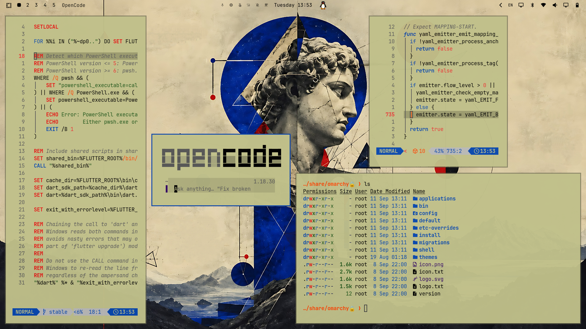
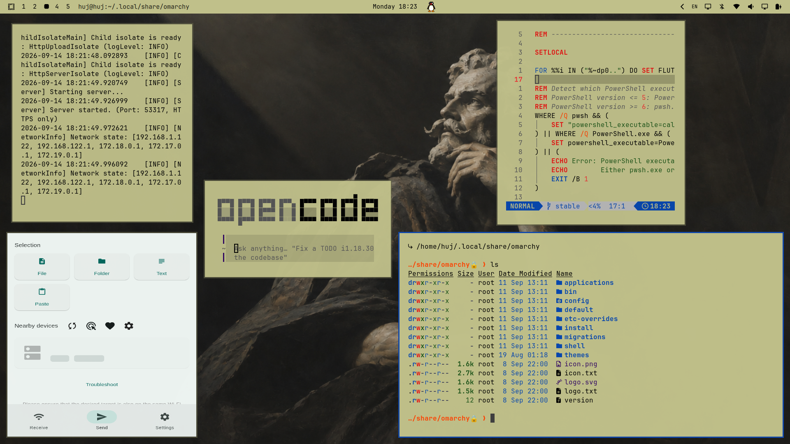
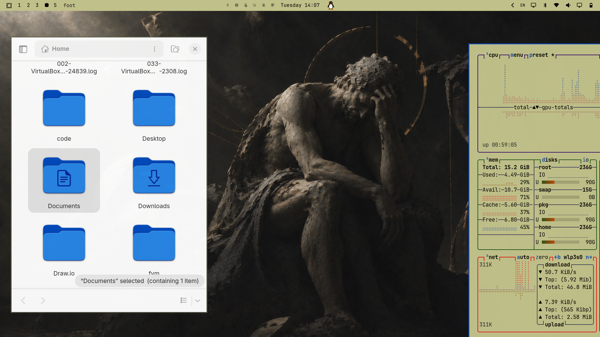
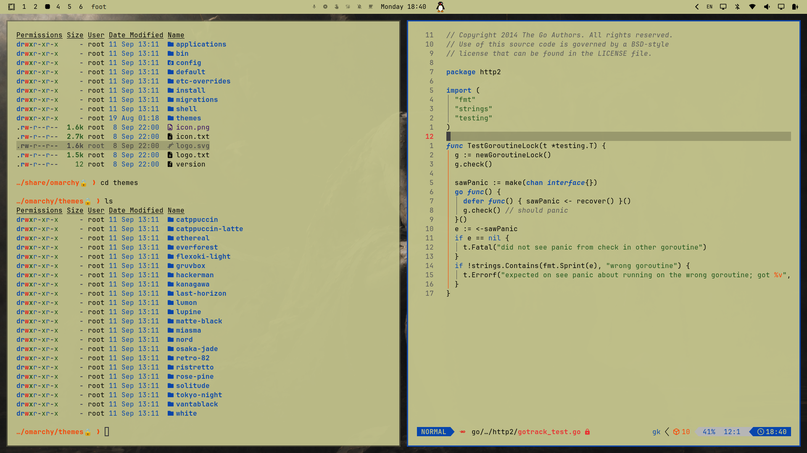
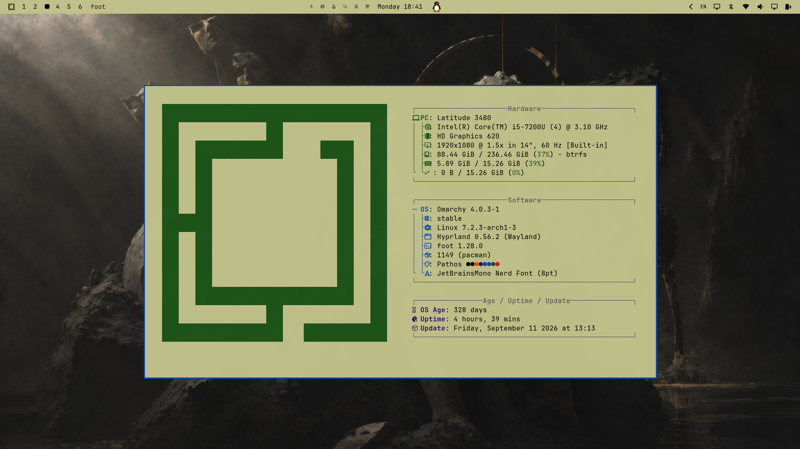

# Pathos

A minimal Omarchy theme inspired by **philosophy and mathematics** for light mode enjoyers.



## Screenshots

|                           |                           |
| ------------------------- | ------------------------- |
|  |  |
|  |  |
|  |  |


## Installation

```bash
omarchy theme install https://github.com/Haflier/omarchy-pathos-theme.git
```

Then:

```bash
omarchy theme set pathos
```

## Neovim (This is optional for better experience)

Aether has additional internal palette colors that are not exposed through Omarchy's 'colors.toml'. Colors that are not provided by Omarchy fall back to Aether's default palette, which can introduce colors outside the Pathos palette.

You can edit Aether's palette files manually to make Neovim fully match Pathos.

Go inside:
```text
~/.local/share/nvim/lazy/aether/lua/aether/colors/init.lua
```

Find this section:

```bash
---@class Palette
local default_palette = {
	bg = "#000000",
	bg_dark = "#000000",
	bg_dark1 = "#000000",
	bg_highlight = "#1a1a1a",

	-- Aether accent colors
	blue = "#66d9ef",
	blue0 = "#264f78",
	blue1 = "#66d9ef",
	blue2 = "#66d9ef",
	blue5 = "#89ddff",
	blue6 = "#b4f9f8",
	blue7 = "#1e3a5f",

	comment = "#585858",
	cyan = "#66d9ef",

	dark3 = "#585858",
	dark5 = "#b8b8b8",

	fg = "#d8d8d8",
	fg_dark = "#b8b8b8",
	fg_gutter = "#585858", -- Same as base03/comment for visibility

	green = "#a6e22e",
	green1 = "#a6e22e",
	green2 = "#73aa6a",

	magenta = "#ae81ff",
	magenta2 = "#f92672",

	orange = "#fd971f",
	purple = "#ae81ff",

	red = "#f92672",
	red1 = "#c91f4f",

	teal = "#66d9ef",
	terminal_black = "#282828",

	yellow = "#f4bf75",

	-- Git colors will be calculated from the palette colors above
	git = {},

	-- Base16 compatibility (deprecated, kept for backward compatibility)
	base00 = "#000000",
	base01 = "#282828",
	base02 = "#383838",
	base03 = "#585858",
	base04 = "#b8b8b8",
	base05 = "#d8d8d8",
	base06 = "#e8e8e8",
	base07 = "#f8f8f8",
	base08 = "#f92672",
	base09 = "#fd971f",
	base0A = "#f4bf75",
	base0B = "#a6e22e",
	base0C = "#66d9ef",
	base0D = "#66d9ef",
	base0E = "#ae81ff",
	base0F = "#cc6633",
}
```

Then replace it with:

```bash
---@class Palette
local default_palette = {
	bg = "#000000",
	bg_dark = "#b8b8b8",
	bg_dark1 = "#000000",
	bg_highlight = "#1a1a1a",

	-- Aether accent colors
	blue = "#0747af",
	blue0 = "#264f78",
	blue1 = "#0747af",
	blue2 = "#0747af",
	blue5 = "#0747af",
	blue6 = "#0747af",
	blue7 = "#1e3a5f",

	comment = "#585858",
	cyan = "#0747af",

	dark3 = "#585858",
	dark5 = "#b8b8b8",

	fg = "#d8d8d8",
	fg_dark = "#000000",
	fg_gutter = "#585858", -- Same as base03/comment for visibility

	green = "#1d5419",
	green1 = "#1d5419",
	green2 = "#143811",

	magenta = "#0747af",
	magenta2 = "#f92672",

	orange = "#ff4200",
	purple = "#0747af",

	red = "#f92672",
	red1 = "#c91f4f",

	teal = "#0747af",
	terminal_black = "#282828",

	yellow = "#330694",

	-- Git colors will be calculated from the palette colors above
	git = {},

	-- Base16 compatibility (deprecated, kept for backward compatibility)
	base00 = "#000000",
	base01 = "#282828",
	base02 = "#383838",
	base03 = "#585858",
	base04 = "#000000",
	base05 = "#000000",
	base06 = "#000000",
	base07 = "#f8f8f8",
	base08 = "#f92672",
	base09 = "#ff4200",
	base0A = "#0747af",
	base0B = "#1d5419",
	base0C = "#0747af",
	base0D = "#0747af",
	base0E = "#0747af",
	base0F = "#ff4200",
}
```

Save it and you are done. You can go back to default any time by changing this section to what is was at first place.
